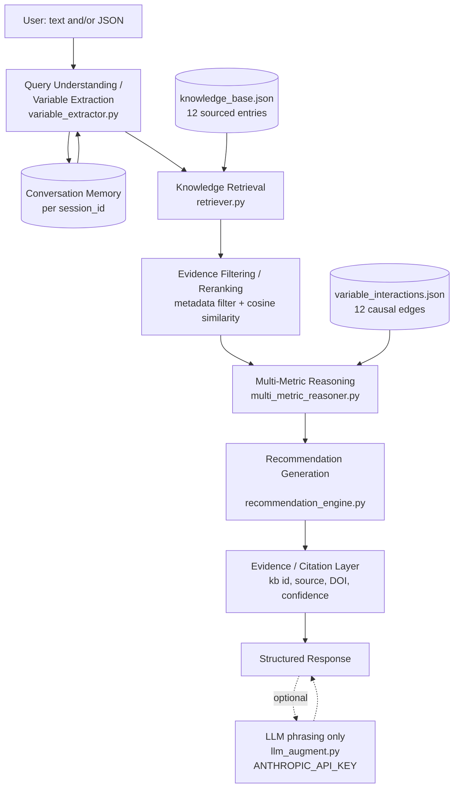

# Darukaa.Earth — AI Biodiversity Intelligence System

An evidence-grounded, multi-metric environmental reasoning system built for the
Darukaa.Earth AI Biodiversity Intelligence Chatbot Challenge. It behaves like an
**AI environmental scientist**, not a chatbot: every recommendation is retrieved
from a structured, citable knowledge base and reasoned over a causal graph of
environmental variables — never generated by an LLM guessing at a plausible-sounding
statistic.

> **Live browser demo:** see the link shared alongside this repository (a
> self-contained, no-signup HTML build of the same knowledge base + reasoning
> engine — open it and try the exact "semi-arid monoculture wheat" example
> from the challenge brief). **GitHub repo:** fill in your repo URL here once
> pushed. See "What you still need to do" at the bottom of this README.

---

## Why this isn't "just an LLM chatbot"

- **Structured, retrievable knowledge base** — [`data/knowledge_base.json`](data/knowledge_base.json):
  12 entries, each traced to a real, checkable source (meta-analyses, regional field
  studies, IPCC/IUCN/FAO reports — see citations inline). No invented statistics,
  authors, or DOIs. Every quantitative claim is tagged `published_measurement`,
  `model_derived_estimate`, or `qualitative_inference` so the system never states an
  estimate with more confidence than the evidence supports.
- **Structured causal graph, not vibes** — [`data/variable_interactions.json`](data/variable_interactions.json):
  12 explicit edges connecting soil, land, climate, water, and biodiversity
  variables (e.g. `rainfall -> soil_moisture -> species_richness`). Multi-metric
  reasoning walks this graph; it cannot invent a new causal claim at answer time.
- **Retrieval is real, not decorative** — semantic embedding search (or a TF-IDF
  fallback with zero external downloads) plus metadata filtering plus a
  guaranteed-non-empty result set. See [`docs/RAG_PIPELINE.md`](docs/RAG_PIPELINE.md).
- **Contradictory evidence is preserved, not smoothed over** — `kb006` on habitat
  fragmentation intentionally encodes a genuine, ongoing scientific disagreement
  (Fahrig 2017 vs. Fletcher et al. 2018) instead of asserting a fake consensus number.
- **Works with zero API calls** — an optional LLM layer
  (`backend/app/reasoning/llm_augment.py`) can add natural-language polish, but the
  full pipeline (retrieval, multi-metric reasoning, evidence-backed
  recommendations, clarifying questions, memory) runs and is unit-tested without
  ever calling an LLM. **Both a follow-up question with no new data (e.g. "how
  do I reduce water pollution here?") and a brand-new fact get a distinct,
  relevant reply** — the reply is generated by re-ranking retrieval against
  what was actually just asked, not by restating accumulated state. See
  `tests/test_api.py::test_chat_follow_up_question_gets_a_distinct_relevant_reply_not_a_repeated_state_dump`.
- **Optional LLM phrasing layer supports Claude or Groq** — set
  `ANTHROPIC_API_KEY` or `GROQ_API_KEY` as a real environment variable (never
  in a committed file) to have an LLM smooth the phrasing of the
  already-computed, already-cited assessment. It is contractually restricted
  (via its system prompt) to phrasing only — it cannot introduce a new
  number, source, or claim. **The browser demo (`frontend/demo.html`)
  intentionally never calls an LLM at all**: a static published page can't
  keep a secret key hidden from anyone who views its source, and (separately)
  Anthropic's artifact-hosting CSP only allows script loads from a small
  allow-list of CDNs, so it can't reach `api.groq.com`/`api.anthropic.com`
  even if a key were embedded. Any LLM phrasing has to happen server-side —
  see "Adding an LLM phrasing key" below.

---

## Quick start (local)

```bash
git clone <your-repo-url>
cd darukaa-biodiversity-ai
cd backend
python -m venv .venv && source .venv/bin/activate     # or your preferred venv tool
pip install fastapi uvicorn pydantic numpy scikit-learn pytest httpx
# Optional, for real embeddings instead of the TF-IDF fallback:
pip install sentence-transformers faiss-cpu
# Optional, for the LLM phrasing layer:
pip install anthropic && export ANTHROPIC_API_KEY=sk-...

PYTHONPATH=. pytest tests/ -v                          # 15 tests, all pass with zero optional deps
PYTHONPATH=. uvicorn app.main:app --reload --port 8000
```

Then:

```bash
curl -s http://localhost:8000/health

curl -s -X POST http://localhost:8000/assess \
  -H "Content-Type: application/json" \
  -d '{
        "session_id": "demo",
        "observation": {
          "soil_organic_carbon_pct": 0.3,
          "rainfall": "low",
          "land_use": "monoculture",
          "crop_type": "wheat",
          "region": "semi-arid"
        }
      }' | python -m json.tool
```

Or run everything in Docker from the repo root:

```bash
docker build -t darukaa-biodiversity-ai .
docker run -p 8000:8000 darukaa-biodiversity-ai
```

### Interactive API docs
Once running, open `http://localhost:8000/docs` (FastAPI's built-in Swagger UI).

### Adding an LLM phrasing key (optional, server-side only)
```bash
pip install requests   # or: pip install anthropic, for Claude instead
export GROQ_API_KEY=your-real-key-here     # or ANTHROPIC_API_KEY
PYTHONPATH=. uvicorn app.main:app --reload --port 8000
```
That's it — `backend/app/reasoning/llm_augment.py` picks up the env var
automatically (`ANTHROPIC_API_KEY` takes priority if both are set) and starts
phrasing the assessment summary. **Do not** put the key in any file in this
repo, and do not paste it into a chat/issue/commit message — if a key has
ever been shared somewhere like that, treat it as compromised and regenerate
it from your provider's dashboard.

---

## Architecture



See [`docs/ARCHITECTURE.md`](docs/ARCHITECTURE.md) for the full component-by-component
writeup, trade-offs considered, and why a lightweight multi-agent-flavored pipeline was
chosen over both a single-prompt LLM call and a heavyweight autonomous multi-agent
framework.

## Repository layout

```
darukaa-biodiversity-ai/
├── backend/
│   ├── app/
│   │   ├── main.py                     FastAPI app: /chat, /assess, /health, /knowledge
│   │   ├── pipeline.py                 Orchestrates the full request -> response flow
│   │   ├── models/schemas.py           Pydantic I/O contracts (incl. structured JSON input)
│   │   ├── knowledge/loader.py         Loads /data into memory
│   │   ├── rag/retriever.py            Embedding/TF-IDF retrieval + metadata filtering
│   │   ├── rag/build_index.py          Optional: persist a FAISS index to disk
│   │   ├── reasoning/variable_extractor.py    Text + JSON -> normalized variables
│   │   ├── reasoning/multi_metric_reasoner.py Walks the causal graph
│   │   ├── reasoning/recommendation_engine.py Evidence -> structured Recommendation
│   │   ├── reasoning/llm_augment.py    Optional LLM phrasing layer (feature-flagged)
│   │   └── conversation/memory.py      Per-session memory + clarification tracking
│   ├── tests/                          15 unit/integration tests (pytest)
│   ├── requirements.txt
│   └── Dockerfile removed here - see root Dockerfile (needs both backend/ and data/)
├── data/
│   ├── knowledge_base.json             The structured knowledge layer (12 sourced entries)
│   └── variable_interactions.json      The causal graph (12 edges) reasoning walks
├── frontend/
│   └── demo.html                       Self-contained browser demo (same KB + reasoning, in JS)
├── docs/
│   ├── ARCHITECTURE.md
│   ├── RAG_PIPELINE.md
│   ├── DATABASE_SCHEMA.md
│   ├── EVALUATION.md
│   └── LIMITATIONS_AND_FUTURE_WORK.md
├── .github/workflows/ci.yml            Runs tests + validates the knowledge base on every push
├── Dockerfile
├── .env.example
└── README.md                           you are here
```

## API summary

| Endpoint | Method | Purpose |
|---|---|---|
| `/health` | GET | Liveness + which retrieval backend is active (`sentence-transformers` or `tfidf`) |
| `/chat` | POST | Free-text (+ optional structured) conversational turn, with memory via `session_id` |
| `/assess` | POST | Pure structured-JSON input (bonus requirement), no text needed |
| `/knowledge` | GET | List all knowledge base sources (transparency) |
| `/knowledge/{id}` | GET | Inspect one knowledge base source in full, incl. its raw citation |

Full request/response schemas: `backend/app/models/schemas.py`, or the live
`/docs` Swagger UI.

### Example: structured JSON input (the challenge's own example use case)

```json
POST /assess
{
  "session_id": "farmer-123",
  "observation": {
    "soil_organic_carbon_pct": 0.3,
    "rainfall": "low",
    "land_use": "monoculture",
    "crop_type": "wheat",
    "region": "semi-arid"
  }
}
```

Returns a structured response with: environmental assessment, the
multi-variable relationship chains it found (e.g.
`rainfall -> soil_moisture -> species_richness`), 1–3 evidence-backed
recommendations (each with mechanism, impacted metrics, time horizon,
confidence, and a real citation), and any clarifying questions still worth
asking.

### Example: multi-turn conversation with memory

```json
POST /chat  {"session_id": "s1", "message": "Biodiversity is declining on my land."}
-> asks clarifying questions (soil organic carbon %, rainfall pattern, land use type)

POST /chat  {"session_id": "s1", "message": "It's a monoculture wheat farm with 0.3% soil organic carbon."}
-> remembers land_use + soil_organic_carbon, still asks about rainfall

POST /chat  {"session_id": "s1", "message": "Rainfall is low."}
-> all 3 critical variables now known -> generates full evidence-backed recommendations,
   does NOT re-ask anything already answered
```

## Testing

```bash
cd backend && PYTHONPATH=. pytest tests/ -v
```

15 tests cover: retrieval relevance and metadata filtering, variable extraction
from free text, multi-metric chain building, anti-fabrication guardrails
(qualitative KB entries must never produce an invented percentage), and
full API round-trips including cross-turn memory.

## CI/CD

`.github/workflows/ci.yml` runs on every push/PR to `main`: installs
dependencies, compiles all Python files, runs the full pytest suite, and
validates the structural integrity of `knowledge_base.json` and
`variable_interactions.json` (no duplicate ids, every edge's `supporting_kb`
references a real document, every document has its required fields).

## Design decisions & trade-offs

See [`docs/ARCHITECTURE.md`](docs/ARCHITECTURE.md) for the full comparison, but briefly:

- **Rule-based variable extraction over LLM extraction**: deterministic, unit-testable,
  zero latency/cost, and fully auditable — appropriate at this hackathon's scope. A
  production version would add an LLM fallback for phrasing the regex patterns don't
  catch (noted as P2 in `docs/LIMITATIONS_AND_FUTURE_WORK.md`).
- **One document = one retrievable chunk** (no sub-chunking): each KB entry is short
  enough (~120–220 words) that splitting it would risk separating a finding from its
  citation — the one failure mode this project treats as unacceptable.
- **TF-IDF fallback, not a hard dependency on sentence-transformers/FAISS**: judges
  can clone and test this with zero model downloads; installing the optional deps
  upgrades to real semantic embeddings with no code changes.
- **LLM is optional and downstream-only**: it never sees the raw knowledge base and
  is contractually restricted (via its system prompt) to phrasing, never inventing
  facts — see `llm_augment.py`.

## What you still need to do before submitting

This repository is complete and tested, but three things are specific to
*you* and can't be filled in on your behalf:

1. **Push this to your own GitHub repository** and put that URL in your
   submission Word document.
2. **If the repo is private**, grant access to the four reviewer accounts
   listed in the challenge PDF (`ankita.dasgupta@darukaa.com`,
   `harsh.kumar@darukaa.com`, `utkarsh.gauniyal@darukaa.com`,
   `guneet.mutreja@darukaa.com`).
3. **Deploy the backend** if you want a live API URL beyond the static
   browser demo (Render/Railway/Fly.io all support the included Dockerfile
   directly) and add that URL to your submission doc.

## License / attribution

Knowledge base sources retain their original authorship — see each entry's
`authors`/`source`/`url`/`doi` field in `data/knowledge_base.json`. Project
code: use freely for this hackathon submission.
